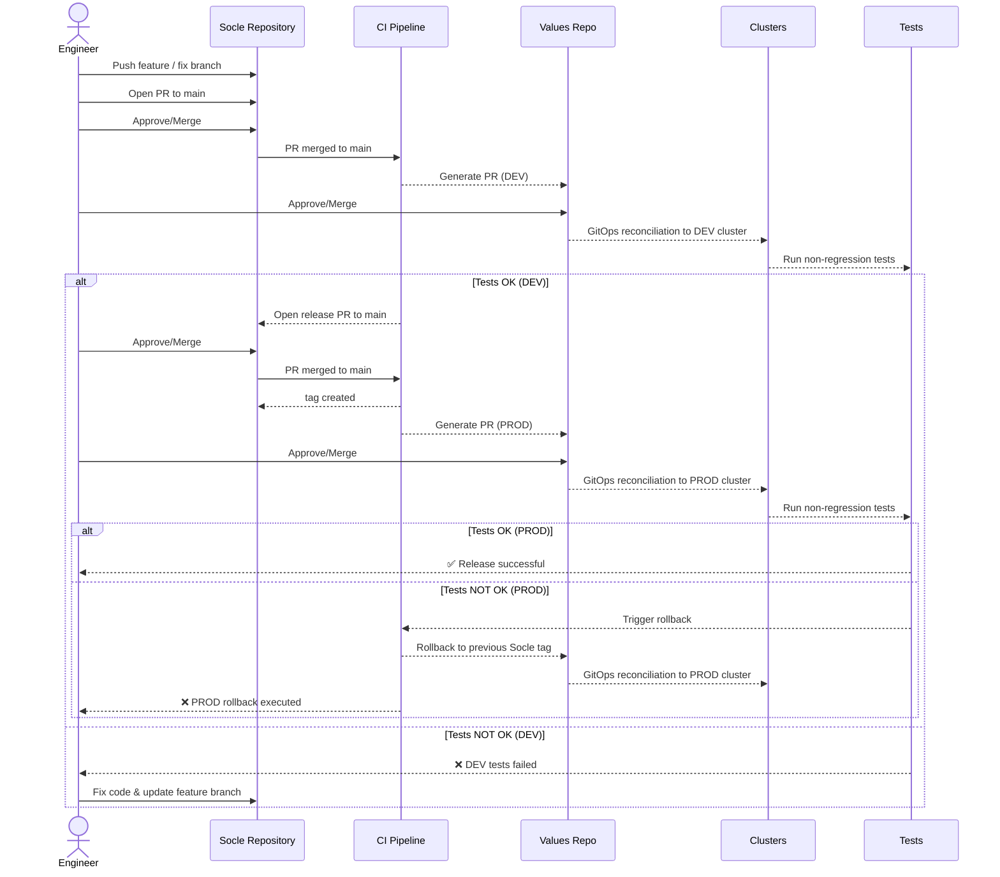

```mermaid
sequenceDiagram
    actor Dev as Engineer
    participant Socle as Socle Repository
    participant CI as CI Pipeline
    participant Values as Values Repo
    participant Clusters as Clusters
    participant Tests as Tests

    %% Manual actions
    Dev->>Socle: Push feature / fix branch
    Dev->>Socle: Open PR to main
    Dev->>Socle: Approve/Merge
    Socle->>CI: PR merged to main

    %% Automatic actions
    CI-->>Values: Generate PR (DEV)
    Dev->>Values: Approve/Merge
    Values-->>Clusters: GitOps reconciliation to DEV cluster
    Clusters-->>Tests: Run non-regression tests

    alt Tests OK (DEV)
        CI-->>Socle: Open release PR to main
        Dev->>Socle: Approve/Merge
        Socle->>CI: PR merged to main
        CI-->>Socle: tag created
        CI-->>Values: Generate PR (PROD)
        Dev->>Values: Approve/Merge
        Values-->>Clusters: GitOps reconciliation to PROD cluster
        Clusters-->>Tests: Run non-regression tests

        alt Tests OK (PROD)
            Tests-->>Dev: ✅ Release successful
        else Tests NOT OK (PROD)
            Tests-->>CI: Trigger rollback
            CI-->>Values: Rollback to previous Socle tag
            Values-->>Clusters: GitOps reconciliation to PROD cluster
            CI-->>Dev: ❌ PROD rollback executed
        end

    else Tests NOT OK (DEV)
        Tests-->>Dev: ❌ DEV tests failed
        Dev->>Socle: Fix code & update feature branch
    end
```
