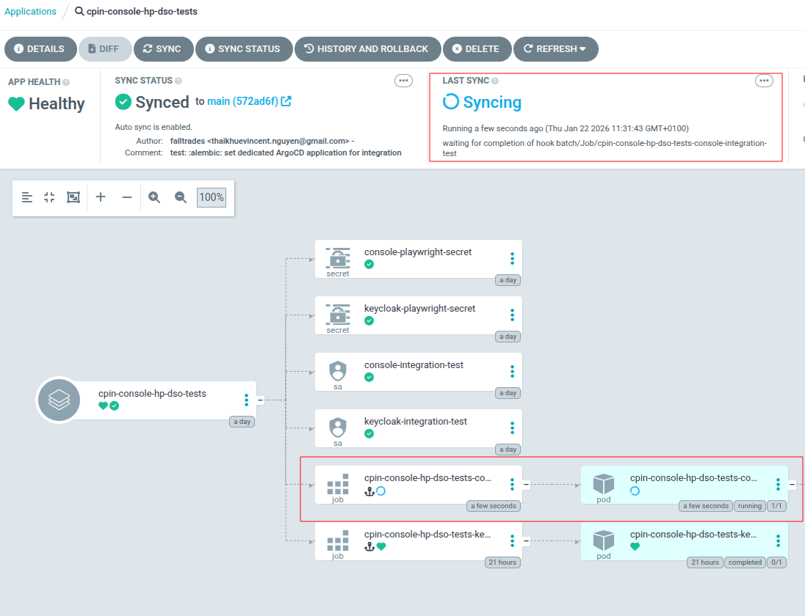
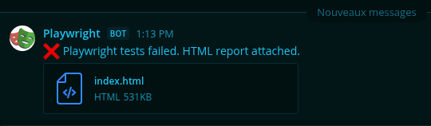
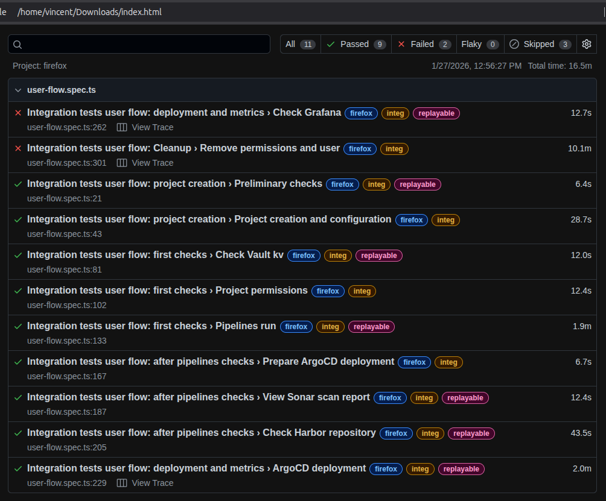

# [How do we make sure nothing breaks ?](./introduction.html)

We've already solved [how to convert code to production](./gitOps.html). Now we must check that everything is still working.  
To do that, we need to know what to test. For that we need to understand the user flow (complete flow [here](https://github.com/cloud-pi-native/socle/issues/611)):
- Log to the console.
- Create a new project.
- Add a build repository.
- Run branch synchonisation.
- Check that pipelines ran succesfully.
- Add infrastructure repository.
- Create a project stage.
- Check that ArgoCD deployment is successful.
- Check application is accessible.

Then we can automate with Playwright (full code available [here](https://github.com/cloud-pi-native/console/tree/main/playwright/integration-tests)).

<video width="320" height="240" controls loop="" muted="" autoplay="">
    <source src="https://github.com/Falltrades/engineering/raw/refs/heads/main/docs/cloudPiNative/misc/playwright-integration-tests.mp4" />
</video>

Put it in container (full code available [here](https://github.com/cloud-pi-native/Dockerfile/tree/main/docker/playwright)) and schedule with ArgoCD.

Enable notification in case of error and get access to Playwright report.

Now it remains to answer the [last problem](./workflow.html)
