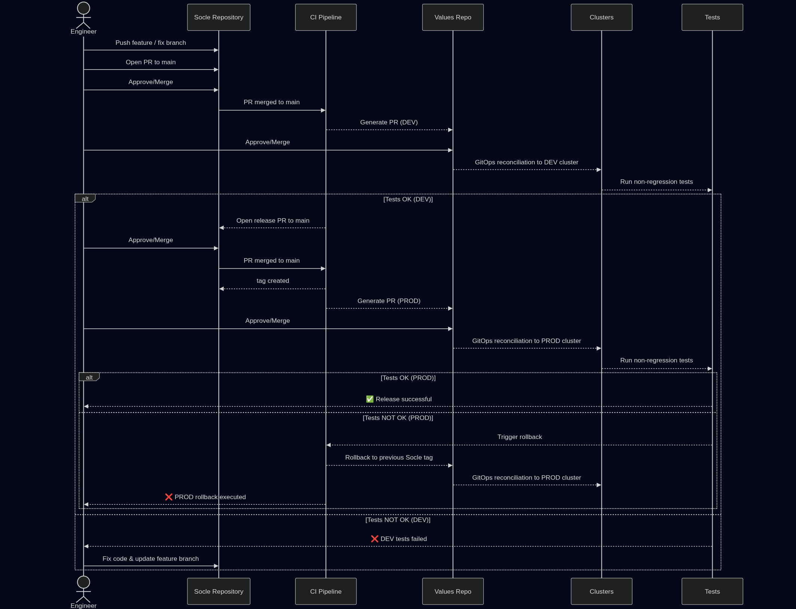

# [How do we deploy new release automatically ?](./introduction.html)

## Problem

We've solved:
- [Converting code to production](./gitOps.html)
- [How do we make sure nothing breaks ?](./test.html)

Now we must solve how to do it without humans in the loop.

If deployment still requires humans to click buttons, copy commands, or _be careful_, then we haven't really automated anything. True automation must be deterministic, observable, and safe. Our objective is simple:
- A developer commits or merges code.
- A new version is built and released.
- No one logs into a server.
- No one runs commands manually.
- No one wonders _did we forget a step?_
- The system deploys, verifies, and can rollback by itself.
In other words: from commit to production, everything is automated and auditable.

## Solution

Deployment is not a script, it's a workflow with clear states and guarantees:
- A new version is detected.
- The version is built and tagged.
- The desired state is updated.
- The platform reconciles reality with that state.
- Rollback is possible at any point.
This is why deployment automation naturally builds on GitOps.

